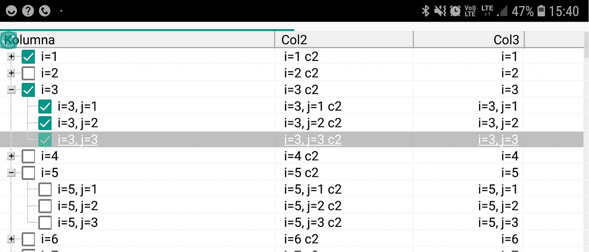

Sample view on Android :)

## About this port to Firemonkey:

### What is working:
- [x] it compiles under FMX - this was main task of this pull request;
- [x] it draw tree nodes structure with apropiate levels;
- [x] it draw nodes text with alignment;
- [x] it draw buttons plus/minus (toShowButtons);
- [x] it draw tree lines (toShowTreeLines), horizontal lines (toShowHorzGridLines), vertical lines (toShowVertGridLines), full vertical lines (toFullVertGridLines) (some pixel improvement needed but it is working);
- [x] it support cliping during cell draw;
- [x] it support multiple columns;
- [x] it draw header columns.
- [x] expanding, collapsing by mouse click.
- [x] mouse cursor and header column resize by mouse.
- [x] it accept focus, it draw focus rect and unfocussed rect, toExtendedFocus, toFullRowSelect, toHotTrack, toUseBlendedSelection.
- [x] checkbox support system checkboxes (platform specific) + custom checkboxes.
- [x] support for Android :)
- [x] "hot" and "selected" plus/minus buttons.
- [x] scrollbars/scrolling.
- [x] toMultiSelect with smDottedRectangle and with smBlendedRectangle.
- [x] mouse wheel scrolling
- [x] it draw static background

### What is not working yet:
- [ ] some mouse actions (drag/drop);
- [ ] clipboard;
- [ ] drawing tree border;
- [ ] drawing background tiled;
- [ ] some mouse actions on header;
- [ ] inplace editors;
- [ ] installing package for both VCL and FMX in the same time.

Current VT is derived from TRectangle.
Will be good to have it as presented control with appropiate TDataModel. 
This will bring more possibilities like have e.g. 2 tree on the form based on same data.
One will be i scale 1 second smaller in scale e.g 0.2 as a preview.

To test FMX port of VT - you must add in the e.g. Delphi project->Options->Conditional defines
**VT_FMX**. There is only package for Delphi Tokyo (but you can test it from the code).
Remember to add also to uses clause unit VirtualTrees.FMX.
#### WARNING. 
If you install package for FMX you can not use installed package for VCL and vice-versa.
I still look for the way to do this. 

# Virtual-TreeView
Virtual Treeview is a Delphi treeview control built from ground up. Many years of development made it one of the most flexible and advanced tree controls available today. Virtual Treeview starts off with the claim to improve many aspects of existing solutions and introduces some new technologies and principles which were not available before.

### Help Needed: Any volunteer that takes care about **C++ Builder** bugs and packages?
I don't use C++ Builder and my experience with it is very limited. This makes it difficult to take care about bugs that are reported in C++ Builder and to maintain the C++ Builder packages. I would be great if someone would volunteer to do this. Please contact me at joachim.marder+CPP@gmail.com.

### Downloads
**V7.2** official release for **RAD Studio XE3 to 10.3 Rio**: [JAM Software](https://www.jam-software.com/virtual-treeview/VirtualTreeView.zip) ([Changes](https://github.com/Virtual-TreeView/Virtual-TreeView/milestone/12?closed=1))

An experimetal **FireMonkey** port can be found here: [livius2/Virtual-TreeView](https://github.com/livius2/Virtual-TreeView)

A port to **Lazarus / FPC** can be found here: [blikblum/VirtualTreeView-Lazarus](https://github.com/blikblum/VirtualTreeView-Lazarus)

For a **Delphi XE2** compatible fork see: [Fr0sT-Brutal/VirtualTreeView_mod/tree/fr0st_xe2](https://github.com/Fr0sT-Brutal/VirtualTreeView_mod/tree/fr0st_xe2)

For a **Delphi XE** compatible fork see: [sglienke/Virtual-TreeView](https://github.com/sglienke/Virtual-TreeView)

**V5.5.3** for **Delphi 7 to XE2**: [Download](http://www.jam-software.com/virtual-treeview/VirtualTreeViewV5.5.3.zip)

**V6 latest stable version** tested on Windows XP/2003 support: [GitHub](https://github.com/Virtual-TreeView/Virtual-TreeView/archive/V6_stable.zip)

For installation instruction see the "INSTALL.TXT" file in the ZIP. [Delphinus](http://memnarch.bplaced.net/blog/2015/08/delphinus-packagemanager-for-delphi-xe-and-newer/)-Support was added.

### Technical Support
Please do not contact developers or JAM Software for technical support. Please try to get support from the community e.g. at [Stack Overflow](http://stackoverflow.com/search?q=%22virtual+treeview%22) , [Delphi Pages](http://www.delphipages.com/), [Delphi Praxis](http://www.delphipraxis.net/141465-virtual-treeview-tutorials-mit-beispielen.html) or [Embarcadero forums](https://forums.embarcadero.com/). Please do not use the issue tracker for getting support, only for reporting true bugs (see below).

### Reporting Bugs
First of all, please make sure you are using the **latest official version**. When **[reporting a bug](https://github.com/Virtual-TreeView/Virtual-TreeView/issues)** please include a **sample** project that allows us to quickly reproduce the bug. This can also be one of the demo projects that come with Virtual Treeview, modified to show the bug. If only small changes are required, a description is sufficient how a demo projects needs to be changed in order to replicate the bug. If you already have a solution, please supply a patch file or make a pull request. If you used a previous version that did not have the bug, please include this version number in your report.

### Feature Requests
We currently focus on reducing the number of reported bugs and getting Virtual Treeview stable. Feature Requests will most likely not processed at the moment. We are only going to process enhancement requests if the new feature is of general interest and a source code patch based on the latest SVN revision is attached to the report. Please mark feature requests with the flag "Enhancement".

### Contributors
If you want to contribute, you are welcome. We always look for help, not only for the development of the Virtual Treeview control itself, but also for maintaining the sample projects, the help or the wiki. Please send an email to: joachim(dot)marder(a)gmail.com

### License
Virtual Treeview is published under a double license: MPL 1.1 and LGPL 2.1 with static linking excpetion as described here: http://wiki.freepascal.org/modified_LGPL

### New project owner
JAM Software took Virtual Treeview under its wing in 2014, but not much will change besides the homepage and download location.
